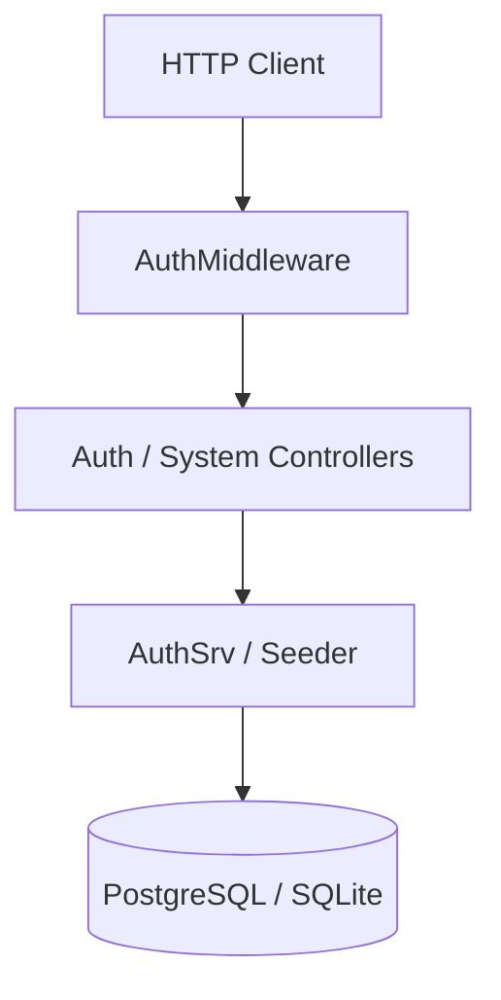

# Drogon Auth Microservice

A high-performance C++23 Authentication Microservice built on the [Drogon Framework](https://drogon.org).

## Features
- **Modern C++**: Built with C++23 standards and C++20 Coroutines.
- **Secure Authentication**: Argon2id password hashing and session-based auth.
- **Two-Factor Authentication**: TOTP support (Google/Microsoft Authenticator).
- **Role-Based Access Control**: Managed via database roles.
- **Multi-DB Support**: PostgreSQL (Production) and SQLite3 (Development).
- **Auto-Seeding**: Automatically ensures an admin account exists on startup.
- **Advanced Logging**: Structured logging with file support and startup diagnostics.

## Architecture Overview
The service follows a modular layered architecture:



For more details, see:
- [Detailed Architecture](./docs/documentation/architecture.md)
- [Database Schema & ERD](./docs/documentation/database.md)
- [Entity Relationship Diagram](./docs/architecture/erd_diagram.md)

## Quick Start

### Prerequisites
- C++23 Compiler (GCC 13+, Clang 16+)
- CMake 3.28+
- Conan 2.x

### Build
1. Install dependencies:
   ```bash
   conan install . --output-folder=build --build=missing -s build_type=Debug
   ```
2. Configure and build:
   ```bash
   cmake --preset conan-debug
   cmake --build --preset conan-debug
   ```

### Configuration
1. Copy `data/_.env.example` to `.env` and adjust the values.
2. Adjust `data/config.example.json` if needed and point `DROGON_CONFIG_FILE` in your `.env` to it.

## API Documentation
The microservice provides endpoints for:
- `POST /api/auth/v1/register`: User registration.
- `POST /api/auth/v1/login`: User login (sets `JSESSIONID`).
- `POST /api/auth/v1/logout`: User logout.
- `GET /api/auth/v1/me`: Current user information (Protected).
- `POST /api/auth/v1/totp/setup`: Setup 2FA (Protected).
- `GET /api/auth/system/health-check`: Service health status.

## License
Apache-2.0 - See [LICENSE](LICENSE) for details.
