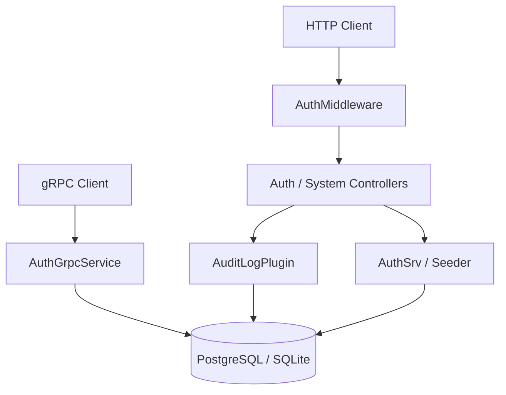

# Drogon Auth Microservice

A high-performance C++23 Authentication Microservice built on the [Drogon Framework](https://drogon.org).

## Features

- **Modern C++**: Built with C++23 standards and C++20 Coroutines.
- **Secure Authentication**: Argon2id password hashing and session-based authentication.
- **Audit Logging**: Asynchronous database-backed action logging via `AuditLogPlugin`.
- **Two-Factor Authentication**: TOTP support (Google/Microsoft Authenticator).
- **gRPC Interface**: Native gRPC server for cross-microservice session and role verification.
- **Role-Based Access Control**: Managed via database roles.
- **Multi-DB Support**: PostgreSQL (Production) and SQLite3 (Development).
- **Auto-Seeding**: Automatically ensures an admin account exists on startup.
- **Advanced Logging**: Structured logging with file support and startup diagnostics.

## Architecture Overview

The service follows a modular layered architecture:


```mermaid
graph TD
    Client[HTTP Client] --> Middleware[AuthMiddleware]
    Client_gRPC[gRPC Client] --> gRPC_Srv[AuthGrpcService]
    Middleware --> Controllers[Auth / System Controllers]
    gRPC_Srv --> DB[(PostgreSQL / SQLite)]
    Controllers --> Plugins[AuditLogPlugin]
    Plugins --> DB
    Controllers --> Services[AuthSrv / Seeder]
    Services --> DB
```

For more details, see our comprehensive English documentation:

- [Architecture & Database](./docs/ARCHITECTURE.md)
- [API Reference](./docs/API_DOCUMENTATION.md)
- [Security Guide](./docs/SECURITY_GUIDE.md)
- [Developer Guide](./docs/DEVELOPER_GUIDE.md)
- [Operations Guide](./docs/OPERATIONS_GUIDE.md)
- [Troubleshooting](./docs/TROUBLESHOOTING.md)

## Quick Start

### Prerequisites

- C++23 Compiler (GCC 13+, Clang 16+)
- CMake 3.31+
- Conan 2.x

### Build

1. Install dependencies:
   ```bash
   conan install . --output-folder=build --build=missing -s build_type=Release
   ```
2. Configure and build:
   ```bash
   cmake --preset conan-release
   cmake --build --preset conan-release -j$(nproc)
   ```

### Configuration

1. Copy `data/_.env.example` to `.env` and adjust the values.
2. Adjust `data/config.example.json` if needed and point `DROGON_CONFIG_FILE` in your `.env` to it.

## License

Apache-2.0 - See [LICENSE](LICENSE) for details.
