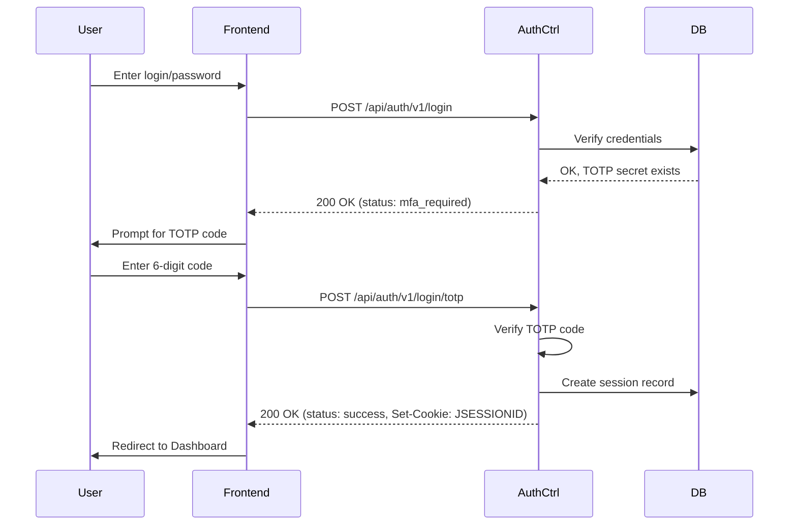
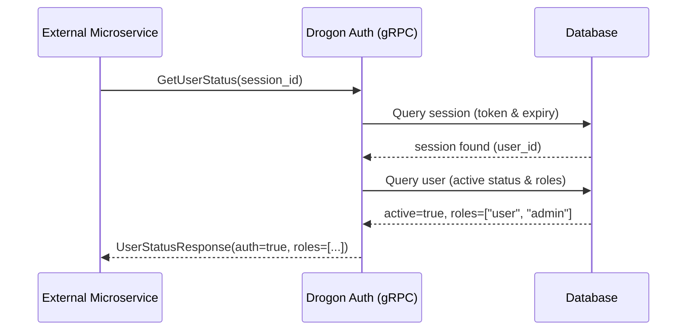
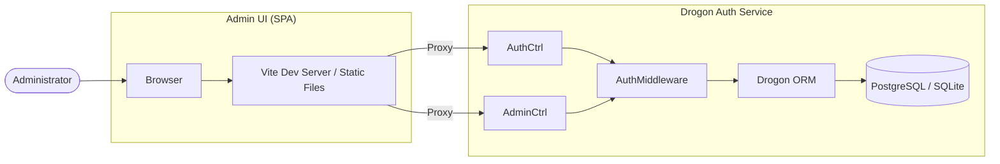
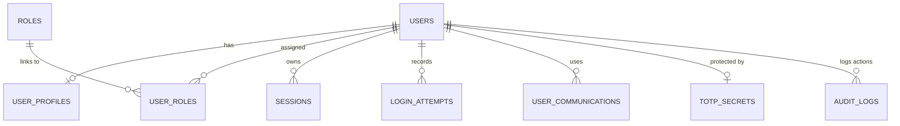
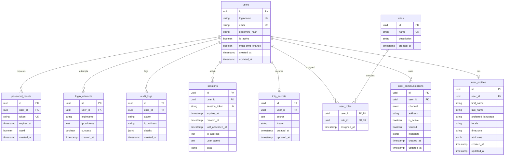

# Architecture Description

## Overview
The Drogon Auth Microservice is built on the **Drogon Framework** (C++23) and features a modern **Vue 3 / Quasar** administration frontend. It follows a layered architecture to ensure scalability, security, and maintainability.

## System Components

### 1. Backend (C++ / Drogon)
The backend provides a high-performance REST API with asynchronous database access.

#### Presentation Layer (Controllers)
- **AuthCtrl**: Handles core identity tasks: registration, login (including 2FA), logout, and profile management.
- **AdminCtrl**: Provides administrative CRUD operations for users and roles.
- **SystemCtrl**: Provides health checks and system information.
- All controllers utilize C++20 Coroutines (`drogon::Task`) for non-blocking I/O.

#### Security Layer (Middleware)
- **AuthMiddleware**: Intercepts requests to protected resources. It validates the session status via `JSESSIONID` and the `authenticated` flag in the server-side session.
- **RBAC Support**: The `AdminCtrl` performs additional role checks to ensure only authorized administrators can modify system data.

#### Business Logic Layer (Services)
- **AuthSrv**: Contains core logic for password hashing (Argon2id via libsodium), TOTP generation/verification, and secure token generation.
- **Seeder**: Ensures system consistency by creating initial admin accounts and required profiles on startup.

#### Data Access Layer (ORM / DB)
- Uses Drogon's asynchronous ORM with explicit transaction management (`COMMIT`).
- Supports PostgreSQL (Production) and SQLite3 (Development).

### 2. Admin Frontend (Vue 3 / Quasar)
A single-page application (SPA) providing a user-friendly interface for administrators.
- **Quasar Framework**: UI components and responsive layout.
- **Pinia**: State management for authentication status.
- **Vite**: Modern build tool and development server with API proxy.

### 3. gRPC Interface (C++ / gRPC)
A native gRPC server running in a background thread.
- **AuthGrpcServiceImpl**: Implements the `AuthService` defined in `auth_service.proto`.
- **Functionality**:
    - **Session Verification**: `GetUserStatus` verifies `JSESSIONID` and returns user status/roles.
    - **Health Check**: `CheckHealth` provides server and database connectivity status.
    - **User Data Retrieval**: `GetUserProfile` and `GetUserCommunications` provide detailed metadata for external services.
- **Database Access**: Directly utilizes the `drogon::app().getDbClient()` for high-speed synchronous lookups.

## Security Flows

### Two-Factor Authentication (2FA) Flow

### Microservice Session Verification (gRPC) Flow

### Audit Logging
The system utilizes the `AuditLogPlugin` to track all sensitive operations:
- **Authentication**: Login success/failure, MFA requirements/failures, Logout.
- **Security Changes**: Password changes, 2FA activations.
- **Account Management**: User creation/deletion (via AdminCtrl).

## Deployment View

# Database Description

The Drogon Auth Microservice uses a relational database (PostgreSQL or SQLite3) to manage users, sessions, and security-related data.

## Entity Relationship Overview

## Tables

### 1. `users`

The core table for user accounts.

- `password_hash`: Stores the Argon2id encoded string (libsodium format).
- `is_active`: Global flag to enable/disable account.
- `must_pwd_change`: Boolean flag for forcing password rotation.

### 2. `roles` & `user_roles`

Implements Role-Based Access Control (RBAC).

- `roles`: `admin`, `user`.

### 3. `sessions`

Server-side session storage.

- `ip_address`: Uses `INET` type (PostgreSQL).
- `expires_at`: Managed via trantor date-time.

### 4. `user_profiles`

Stores personal data.

- `first_name`, `last_name`, `preferred_language`, `timezone`.

### 5. `user_communications`

Contact methods for notifications.

- `channel`: Enum (`email`, `pushover`, `telegram`, `whatsapp`).

### 6. `totp_secrets`

Sensitive secrets for Two-Factor Authentication.

- If a record exists here for a user, MFA is enforced during login.

### 7. `audit_logs` & `login_attempts`

Security monitoring.

- `audit_logs`: Detailed JSON data for security-relevant events.
- `login_attempts`: Specific tracking of auth success/failure with IP and user agent.

### 8. `password_resets`

Tokens for the secure password recovery flow.

## Implementation Notes

- **PostgreSQL**: Uses `pgcrypto` for UUID generation and `INET` for network addresses.
- **SQLite3**: Compatibility layer using standard text/integer fields where specialized types aren't available.
- **Transactions**: All operations involving multiple tables or security-critical data use explicit transactions with manual `COMMIT`.

## Entity Relationship Diagram (ERD)

This diagram describes the database schema used by the Drogon Auth Microservice.

