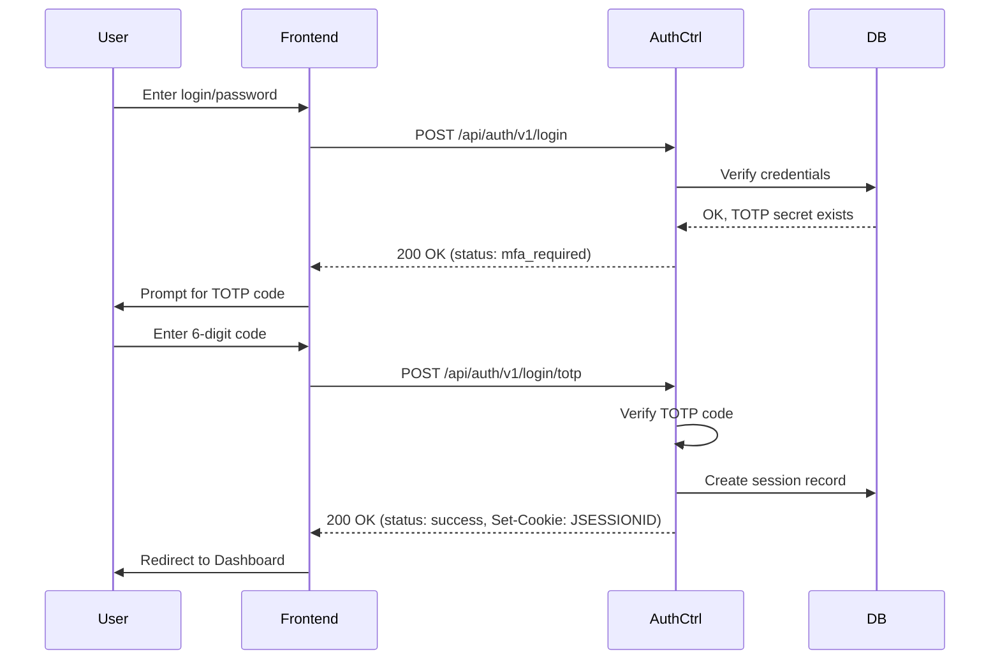
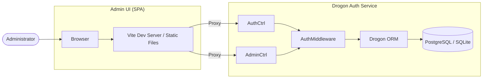

# Architecture Description

## Overview
The Drogon Auth Microservice is built on the **Drogon Framework** (C++23) and features a modern **Vue 3 / Quasar** administration frontend. It follows a layered architecture to ensure scalability, security, and maintainability.

## System Components

### 1. Backend (C++ / Drogon)
The backend provides a high-performance REST API with asynchronous database access.

#### Presentation Layer (Controllers)
- **AuthCtrl**: Handles core identity tasks: registration, login (including 2FA), logout, and profile management.
- **AdminCtrl**: Provides administrative CRUD operations for users and roles.
- **SystemCtrl**: Provides health checks and system information.
- All controllers utilize C++20 Coroutines (`drogon::Task`) for non-blocking I/O.

#### Security Layer (Middleware)
- **AuthMiddleware**: Intercepts requests to protected resources. It validates the session status via `JSESSIONID` and the `authenticated` flag in the server-side session.
- **RBAC Support**: The `AdminCtrl` performs additional role checks to ensure only authorized administrators can modify system data.

#### Business Logic Layer (Services)
- **AuthSrv**: Contains core logic for password hashing (Argon2id via libsodium), TOTP generation/verification, and secure token generation.
- **Seeder**: Ensures system consistency by creating initial admin accounts and required profiles on startup.

#### Data Access Layer (ORM / DB)
- Uses Drogon's asynchronous ORM with explicit transaction management (`COMMIT`).
- Supports PostgreSQL (Production) and SQLite3 (Development).

### 2. Admin Frontend (Vue 3 / Quasar)
A single-page application (SPA) providing a user-friendly interface for administrators.
- **Quasar Framework**: UI components and responsive layout.
- **Pinia**: State management for authentication status.
- **Vite**: Modern build tool and development server with API proxy.

## Security Flows

### Two-Factor Authentication (2FA) Flow

### Audit Logging
The system utilizes the `AuditLogPlugin` to track all sensitive operations:
- **Authentication**: Login success/failure, MFA requirements/failures, Logout.
- **Security Changes**: Password changes, 2FA activations.
- **Account Management**: User creation/deletion (via AdminCtrl).

## Deployment View

