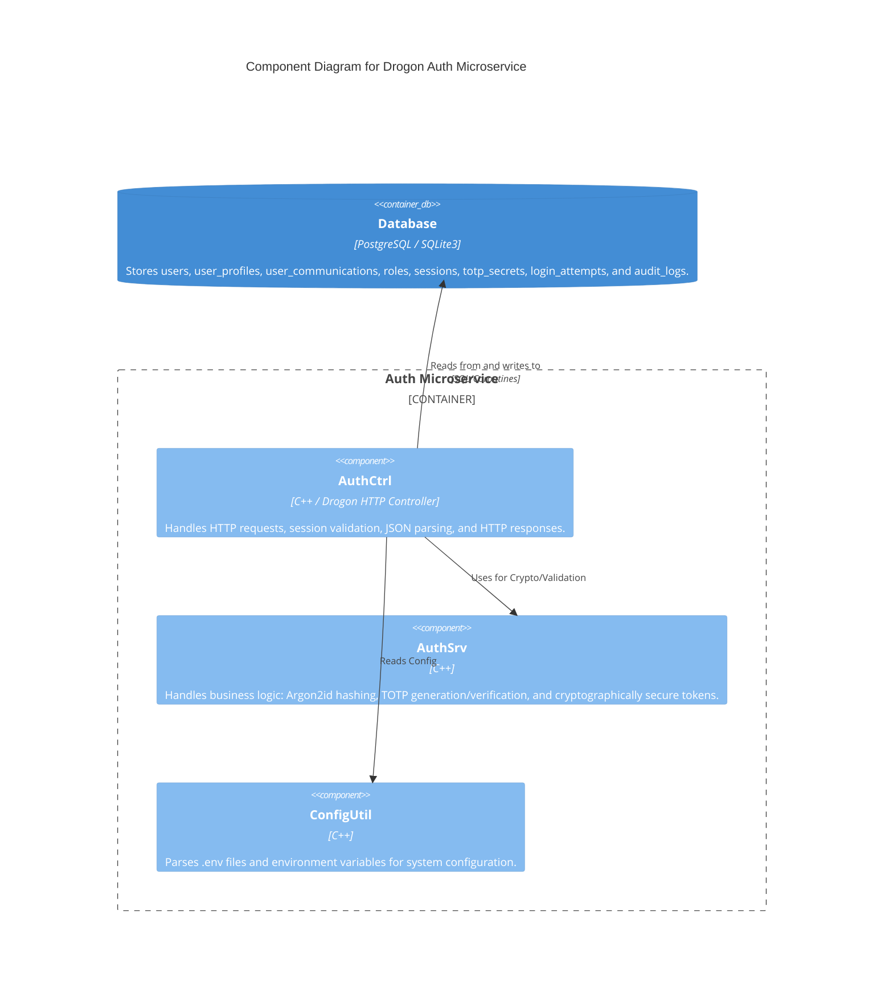

# Architecture Diagram

```mermaid
C4Component
    title Component Diagram for Drogon Auth Microservice

    Container_Boundary(api, "Auth Microservice") {
        Component(ctrl, "AuthCtrl", "C++ / Drogon HTTP Controller", "Handles HTTP requests, session validation, JSON parsing, and HTTP responses.")
        Component(srv, "AuthSrv", "C++", "Handles business logic: Argon2id hashing, TOTP generation/verification, and cryptographically secure tokens.")
        Component(config, "ConfigUtil", "C++", "Parses .env files and environment variables for system configuration.")
    }

    ContainerDb(db, "Database", "PostgreSQL / SQLite3", "Stores users, user_profiles, user_communications, roles, sessions, totp_secrets, login_attempts, and audit_logs.")

    Rel(ctrl, srv, "Uses for Crypto/Validation")
    Rel(ctrl, config, "Reads Config")
    Rel(ctrl, db, "Reads from and writes to", "SQL/Coroutines")
```
