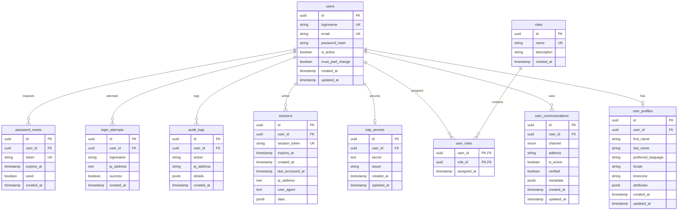

# Entity Relationship Diagram (ERD)

This diagram describes the database schema used by the Drogon Auth Microservice.

```mermaid
erDiagram
    users ||--o| user_profiles : "has"
    users ||--o{ user_communications : "uses"
    users ||--o| totp_secrets : "secures"
    users ||--o{ user_roles : "assigned"
    users ||--o{ sessions : "active"
    users ||--o{ audit_logs : "logs"
    users ||--o{ login_attempts : "attempts"
    users ||--o{ password_resets : "requests"
    roles ||--o{ user_roles : "contains"

    users {
        uuid id PK
        string loginname UK
        string email UK
        string password_hash
        boolean is_active
        boolean must_pwd_change
        timestamp created_at
        timestamp updated_at
    }

    user_profiles {
        uuid id PK
        uuid user_id FK
        string first_name
        string last_name
        string preferred_language
        string locale
        string timezone
        jsonb attributes
        timestamp created_at
        timestamp updated_at
    }

    user_communications {
        uuid id PK
        uuid user_id FK
        enum channel
        string address
        boolean is_active
        boolean verified
        jsonb metadata
        timestamp created_at
        timestamp updated_at
    }

    roles {
        uuid id PK
        string name UK
        string description
        timestamp created_at
    }

    user_roles {
        uuid user_id PK, FK
        uuid role_id PK, FK
        timestamp assigned_at
    }

    sessions {
        uuid id PK
        uuid user_id FK
        string session_token UK
        timestamp expires_at
        timestamp created_at
        timestamp last_accessed_at
        inet ip_address
        text user_agent
        jsonb data
    }

    totp_secrets {
        uuid id PK
        uuid user_id FK
        text secret
        string issuer
        timestamp created_at
        timestamp updated_at
    }

    audit_logs {
        uuid id PK
        uuid user_id FK
        string action
        string ip_address
        jsonb details
        timestamp created_at
    }

    login_attempts {
        uuid id PK
        uuid user_id FK
        string loginname
        inet ip_address
        boolean success
        timestamp created_at
    }

    password_resets {
        uuid id PK
        uuid user_id FK
        string token UK
        timestamp expires_at
        boolean used
        timestamp created_at
    }
```
