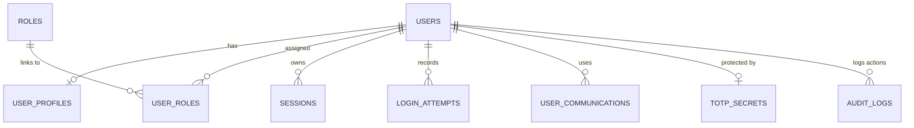

# Database Description

The Drogon Auth Microservice uses a relational database (PostgreSQL or SQLite3) to manage users, sessions, and security-related data.

## Entity Relationship Overview

## Tables

### 1. `users`
The core table for user accounts.
- `password_hash`: Stores the Argon2id encoded string (libsodium format).
- `is_active`: Global flag to enable/disable account.
- `must_pwd_change`: Boolean flag for forcing password rotation.

### 2. `roles` & `user_roles`
Implements Role-Based Access Control (RBAC).
- `roles`: `admin`, `user`.

### 3. `sessions`
Server-side session storage. 
- `ip_address`: Uses `INET` type (PostgreSQL).
- `expires_at`: Managed via trantor date-time.

### 4. `user_profiles`
Stores personal data.
- `first_name`, `last_name`, `preferred_language`, `timezone`.

### 5. `user_communications`
Contact methods for notifications. 
- `channel`: Enum (`email`, `pushover`, `telegram`, `whatsapp`).

### 6. `totp_secrets`
Sensitive secrets for Two-Factor Authentication.
- If a record exists here for a user, MFA is enforced during login.

### 7. `audit_logs` & `login_attempts`
Security monitoring.
- `audit_logs`: Detailed JSON data for security-relevant events.
- `login_attempts`: Specific tracking of auth success/failure with IP and user agent.

### 8. `password_resets`
Tokens for the secure password recovery flow.

## Implementation Notes
- **PostgreSQL**: Uses `pgcrypto` for UUID generation and `INET` for network addresses.
- **SQLite3**: Compatibility layer using standard text/integer fields where specialized types aren't available.
- **Transactions**: All operations involving multiple tables or security-critical data use explicit transactions with manual `COMMIT`.
